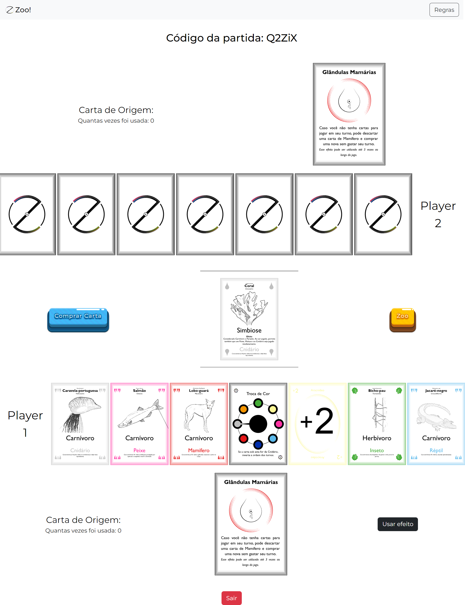

<h1 align="center">Zoo! ONLINE</h1>
<h2 align="center">Two player online game of Zoo!</h2>


## ❓ About the Game

This two-player online version of the game was built with [React](https://reactjs.org/), [Socket.IO](https://socket.io/), [Express](https://expressjs.com/), [Bootstrap](https://getbootstrap.com/) and [Node](https://nodejs.org/en/). It currently supports two-players in each game. It also has text chat functionality to communicate with your opponent!

[git reference tutorial](https://github.com/mizanxali/uno-online)

## 🧐 How to Play?

1. Once you're on the homepage of the game, you can either host a new game or join a friend's game.
2. To host a new game, click on CREATE GAME. A game code will be generated which you can share with your friend.
3. To join a friend's game, enter the game code given by them, and click on JOIN GAME.
4. That's it! Enjoy the game and remember, no toxicity!

## 🎮 Screenshots


## 🏁 Getting Started (to run game locally)

Follow the steps below, after cloning the repository:

### 🖐 Requirements

**For Installing:**

- Node

**For Running:**

- Change socket.IO endpoint on client side. To do this, go to `client/src/components/Game.js` and change line #26 from `const ENDPOINT = 'https://uno-online-multiplayer.herokuapp.com/'` to `const ENDPOINT = 'http://localhost:5000'`

### ⏳ Installation

- At the root of the project directory, use npm to install the server-side dependencies

```bash
npm install
```

This command installs all the server-side dependencies needed for the game to run locally.

- Use npm to run server

```bash
npm start
```

This command gets the server running on localhost port 5000.

- In a separate terminal, navigate into the client folder and use npm to install the client-side dependencies

```bash
cd client
npm install
```

This command installs all the client-side dependencies needed for the game to run locally.

- Finally, use npm to run client

```bash
npm start
```

This command gets the client running on localhost port 3000.

Head over to http://localhost:3000/ and enjoy the game! 🎉

